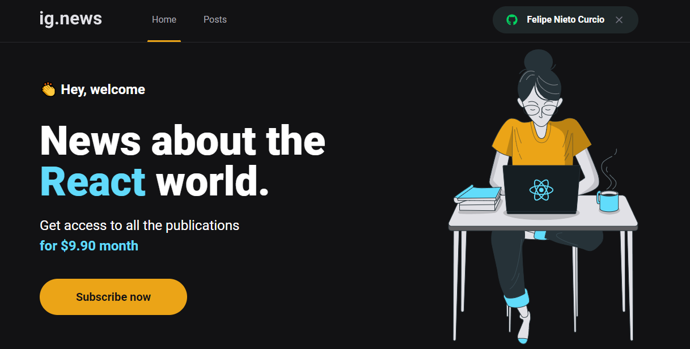
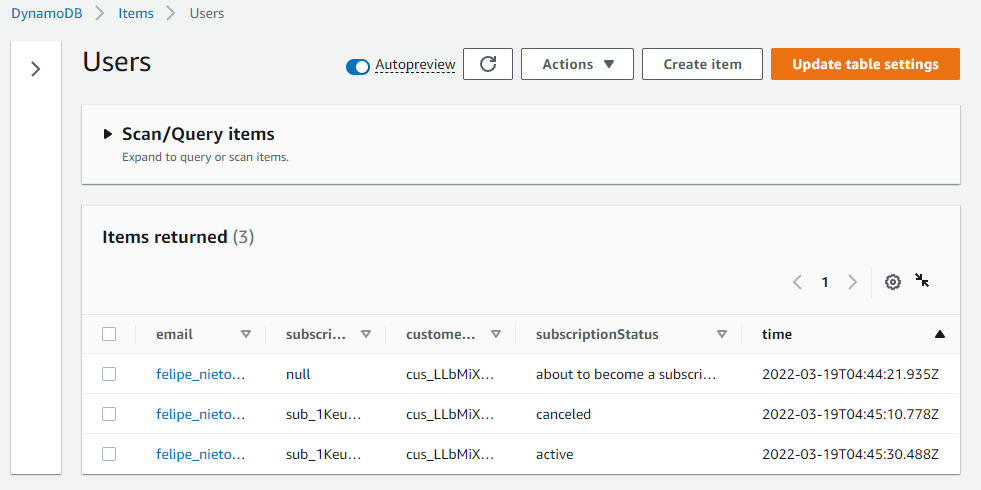
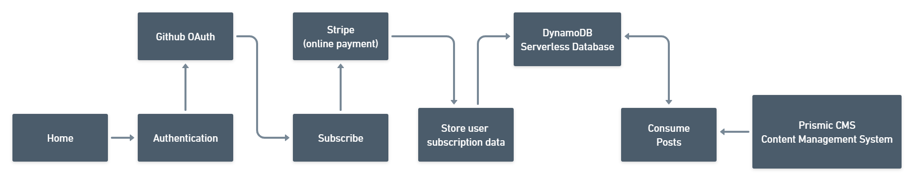

# Nextjs - JAMSTACK Project

> A JAMSTack project that uses the DynamoDB serverless database, Stripe online payment service and Prismic CMS. It's a blog with content for subscribed users.

JAMStack stands for Javascript, API and Markup.

Different from legacy apps, a traditional website that run in a web server in a MVC model (like Apache), the JAMStack approach decouples the front-end from the back-end, can be deployed directly to a CDN like and consume third party services like Stripe, Prismic CMS, DynamoDB, FaunaDB e etc. It also makes use of Static site generation, i.e. the content that can be generated before a request is prebuilt.

## DynamoDB

DynamoDB primary key for a _Table_ can be composed by two attributes, a _Partition key_ and a _Sort key_. One example shown [in the documentation](https://docs.aws.amazon.com/amazondynamodb/latest/developerguideHowItWorks.CoreComponents.html) is that the Music Table uses Artist as the Partition key and SongTitle for Sort Key. It means a Artist can have many songs, in our case, a user can have many subscriptions, then the Sort key design is architectured as shown in documentation: [Best Practices for Using Sort Keys to Organize Data](https://docs.aws.amazon.com/amazondynamodb/latest/developerguide/bp-sort-keys.html)

This project uses the user email as Partition key and the subscription ID provided by the Stripe API, since an user could have more than a subscription, with this architecture we have the advantage of following customer's subscription history, once the user clicks in the "subscribe now" button, the "subscriptionStatus" gets updated from "non subscriber" to "about to become a subscriber":

  

In order to set up the AWS SDK, the [shared credentials file](https://docs.aws.amazon.com/sdk-for-javascript/v3/developer-guide/loading-node-credentials-shared.html) was properly configured through an administrator IAM user.

### Serverless

Quote from AWS:

"With DynamoDB, there are no servers to provision, patch, or manage, and no software to install, maintain, or operate. DynamoDB automatically scales tables to adjust for capacity and maintains performance with zero administration. Availability and fault tolerance are built in, eliminating the need to architect your applications for these capabilities."

## Stripe

Stripe is a service for online payment, in this project there's one product, that is the monthly subscription. When the user subscribes it's created a customer. The project also makes use of webhooks through Next.js API Routes, then Stripe is able to send real-time events to the application and handle the events accordingly, for example send an event that a subscription is not active anymore.

### API Routes & Serverless

Through Next.js we can create an API endpoint as a Node.js serverless function; it fits very well with a serverless database such as DynamoDB. The API Route in the application will be executed in an isolated environment in a scalable way, instead of the resource being served 24/7. This is handled by the cloud provider like AWS, it will up or down an isolated environment as demand.

Since serverless functions run on server-side, [next-auth](https://next-auth.js.org/) is able to perform authentication strategies, this project uses Github OAuth.

## SSR, SSG and SEO

Next.js is optimized for SEO, since it pre-renders the HTML of the pages. There are two forms of [pre-rendering](https://nextjs.org/learn/basics/data-fetching/two-forms):

- SSR (Server-side Rendering): the HTML is generated on each request, useful for when we need to pre-render data that gets updated frequently or when we cannot pre-render a page ahead of a user's request.

- SSG (Static site Generation): the HTML is generated at build time, this makes it much faster than SSR, it is useful when we can pre-render a page ahead of user request, i.e. it's static content available for all users. Next.js will make use of getStaticPaths and getStaticProps to build the static pages, it will follow the "paths" and "fallback" parameters returned in the [getStaticPaths](https://nextjs.org/learn/basics/dynamic-routes/dynamic-routes-details) to generate static pages with dynamic routes.

Since Nextjs uses pre-rendering, it's optimized to be indexed in google (the Googlebots or Google's web crawlers will get the page with content). By default Next.js pre-renders the pages into static HTML.

### Content Management System (CMS)

With Prismic.io headless CMS we can manage the content of our blog, we are also able to preview an unpublished post with Prismic and Next.js integration.

## Application flow

  

## Rocketseat Ignite

I studied this project during the ReactJS Ignite by [Rockeseat](https://www.rocketseat.com.br/), in 2022. I received the opportunity for a scholarship and I am very grateful for it. The original project lectured in the course uses [FaunaDB](https://fauna.com/), instead of [DynamoDB](https://aws.amazon.com/dynamodb/), I decided to use the Amazon Serverless Database to learn how to use it and put personal touch in the project, since it also works very well for serverless applications.

## Vercel Deploy

https://jamstack-mu.vercel.app/
